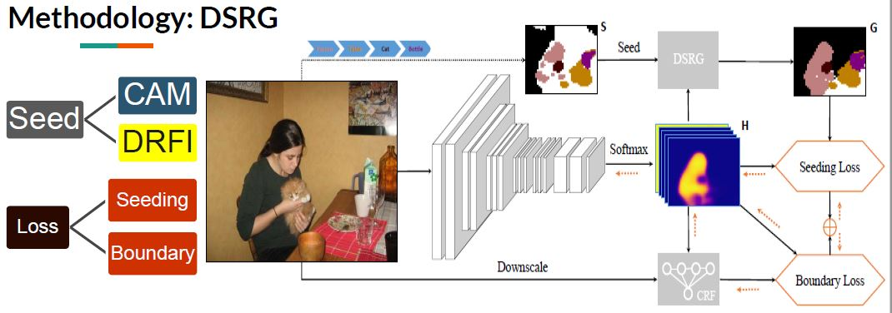
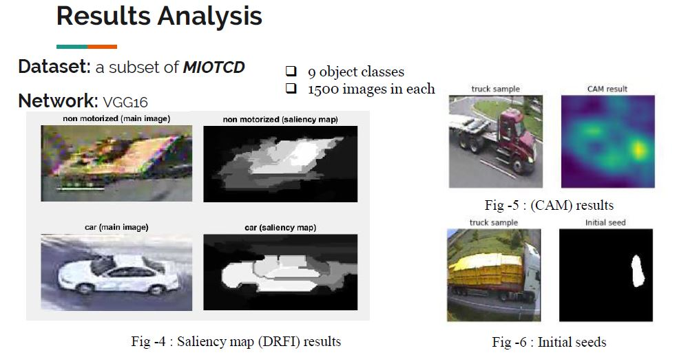

### Introduction

This is a project in which we use the [DSRG](https://github.com/speedinghzl/DSRG) and implemet it using tensorflow. The DSRG is referring to the approach for weakly-supervised semantic segmentation in the paper ["Weakly-Supervised Semantic Segmentation Network with Deep Seeded Region Growing"](https://github.com/speedinghzl/DSRG). 

### About 

Semantic segmentation, is a novel image annotating approach, coming towards “Classification” and “Object Detection”. As we know, classification is the process of determining the type of object to which the input image belongs to, also called as “image-level label”; and “Object Detection” a process providing information about the location and size of the image. Semantic Segmentation deals with labelling individual pixels of the images as an instance of object classes.

### Preparation

for using this code, you have to do something else:

##### 1. Install pydensecrf

For using the densecrf in python, we turn to the project [pydensecrf](https://github.com/lucasb-eyer/pydensecrf). And you just using the following code to install it.

> pip install pydensecrf

##### 2. Download the data and model

1. for pascal data, please referring to its [official website](http://host.robots.ox.ac.uk/pascal/VOC/)  and to the augmental [SBD data](http://home.bharathh.info/pubs/codes/SBD/download.html). Just download it and extract it in the data/, then 'cd data' and run convert.py with 'python convert.py'.
2. for localization_cues-cal.pickle, please referring to [DSRG](https://github.com/speedinghzl/DSRG) or [BaiduNetdisk](https://pan.baidu.com/s/14a94qw4nBulqqKHLMbQGUg)(which fetching code is qgig). And download it and extract it in the data/.
3. for init.model, you can download it from [googledriver](https://drive.google.com/file/d/1kxDguwRaIDm5WS6JTNzi8GO-HqKJqKnm/view) or [BaiduNetdisk](https://pan.baidu.com/s/1Q1wmAX7Do9jvvLMt3_8tFw). Just download it and put it in model/.

### Training

then, you just input the following sentence to train it.

> python DSRG.py <gpu_id>
### Methodology 

    

### Result

Our results looked like this!

### Trained model
[google_driver](https://drive.google.com/open?id=1hlSl1EaDKWA00hvd6Ar0xDZ9uOZ7HKYu)
[BaiduNetdisk](https://pan.baidu.com/s/1vITyeBR5kxaGcOF0BHGkJA)

